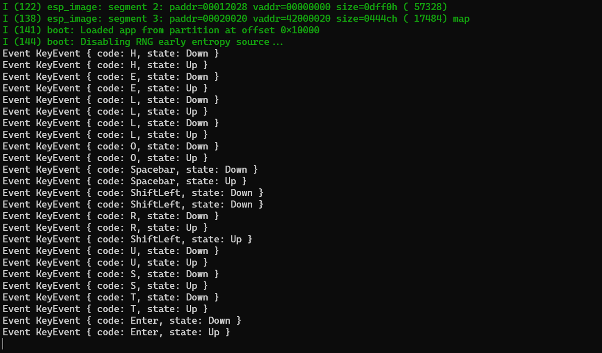

# ESP32-C3 interfacing to a PS/2 Keyboard (bare-metal Rust)

The example of connecting a PS/2 keyboard and USB keyboard with PS/2 COMBO mode support to ESP32-C3.

You need to build it with the release profile (i.e. `cargo run --release`) since otherwise the interrupt latency is too slow.



## Circuit

- 2 x 2.2kΩ resitors
- 2 x 120Ω resitors
```

    Keyboard                                    ESP32-C3

    5V      ━━━━━━━━━━━━━━━━━━━━━━━━━━━━━━━━━━━━━━  5V

    GND     ━━━━━━━━━━━━━━━━━━━━━━━━━━━━━━━━━━━━━━  GND

                                        ┏━━━━━┓
    DATA    ━━━━━━━━━━━━━━━━━━━━━┳━━━━━━┫ 120 ┣━━━  IO1
                                 ┃      ┗━━━━━┛
                                ┏┻┓
                                ┃2┃
                                ┃.┃
                                ┃2┃
                                ┃k┃
                                ┗┳┛
                                 ┃
                                 ┣━━━━━━━━━━━━━━━━  3V3
                                 ┃
                                ┏┻┓
                                ┃2┃
                                ┃.┃
                                ┃2┃
                                ┃k┃
                                ┗┳┛
                                 ┃      ┏━━━━━┓
    CLK     ━━━━━━━━━━━━━━━━━━━━━┻━━━━━━┫ 120 ┣━━━  IO2
                                        ┗━━━━━┛

```

### Wiring to PS/2 connector

The pinout of PS/2 connector is available at [Wikipedia](https://en.wikipedia.org/wiki/PS/2_port).

Hint 1: use [wire wrapping](https://youtu.be/L-463vchW0o?si=MtQrXpbTJznikXSJ) to connect wires to PS/2 connector

Hint 2: make sure to flip the [PS/2 pinout](https://en.wikipedia.org/wiki/PS/2_port#/media/File:PS-2_Y-cable_pinout_female.gif) if connecting to the male part the connector or to the back part of the connector.

### Wiring to USB connector

The same circuit works with USB keyboards with PS/2 COMBO mode support.
It's sufficient to replace PS/2 connector with USB connector according
the schematics [USB to PS2 schematics](https://www.instructables.com/USB-to-PS2-convertor/).

## Examples

### Keyboard to serial converter

The example converts keyboard to serial which can be then consumed by other board.
The receiver board can use [pc-keyboard crate](https://crates.io/crates/pc-keyboard) to decode signals. The following connection is used in [RustZX-ESP32](https://github.com/georgik/rustzx-esp32/tree/main/m5stack-cores3) project.

```
  ESP32-C3 Converter                         ESP32-S3 Receiver

     RX IO4 ━━━━━━━━━━━━━━━━━━━━━━━━━━━━━━━━━━━━━━ TX IO17

     TX IO5 ━━━━━━━━━━━━━━━━━━━━━━━━━━━━━━━━━━━━━━ RX IO18

     GND    ━━━━━━━━━━━━━━━━━━━━━━━━━━━━━━━━━━━━━━ GND
```

Run: `cargo run --release --example keyboard_to_serial`
